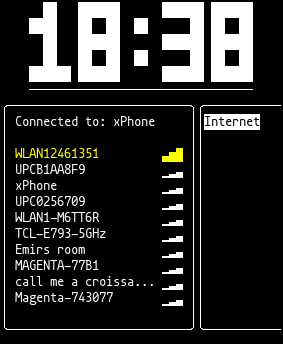

# Super Clock
Terminal UI app with a big clock, ability to connect to internet...

Requires nmcli to run.



## How to start
```
cargo run
```

## How to navigate
```
up, down                    - nav menu
q                           - quit

Internet
--------
shift + up, shift + down    - scroll list
tab                         - connection info
enter                       - prompt password to connect to wifi
esc                         - cancel prompt password
```

## How to compile
Will create and compile new version of this app
```
./update.sh
```